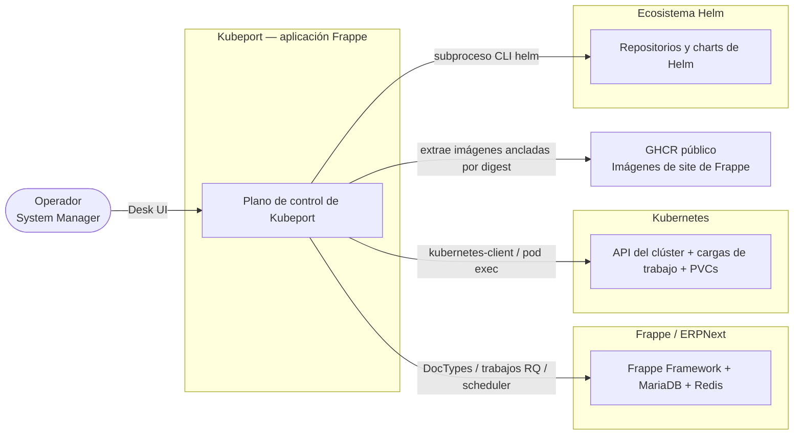
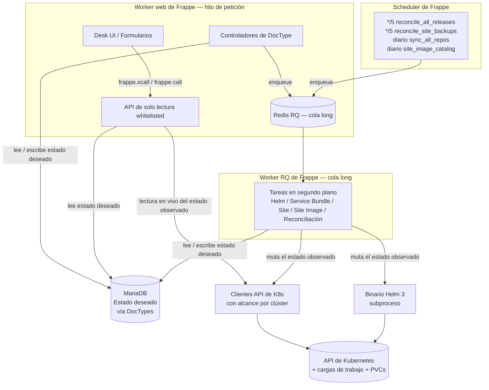
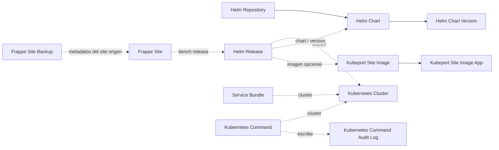
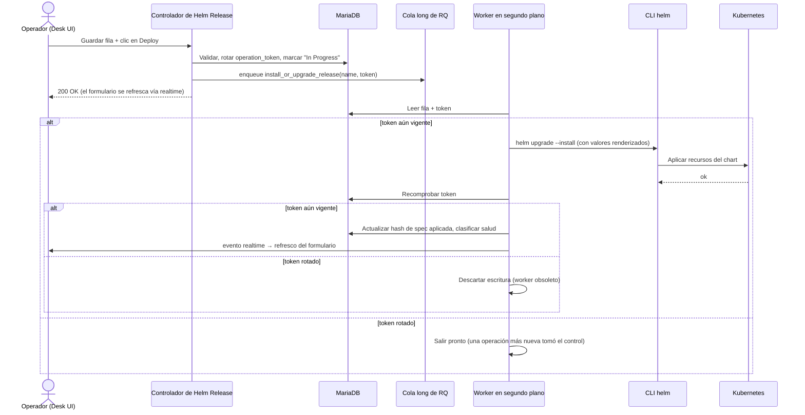
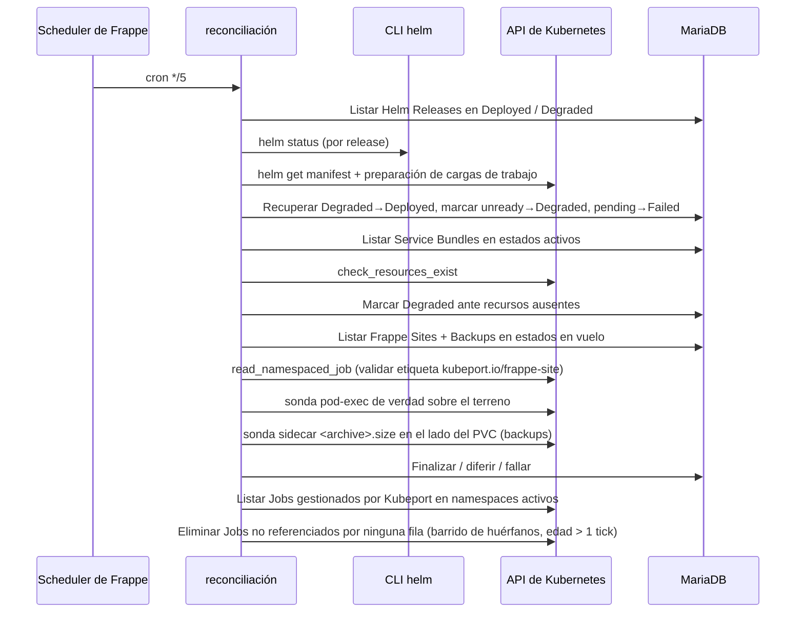
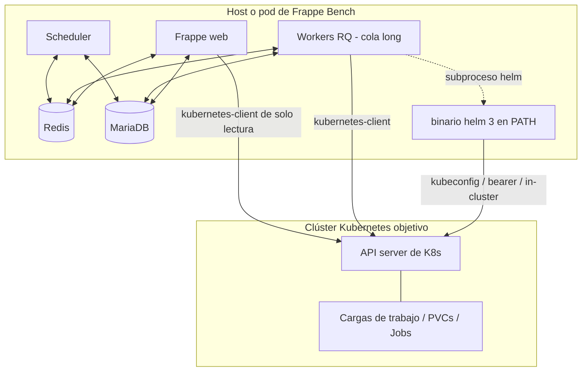

# Kubeport — Arquitectura

Este documento describe la arquitectura de Kubeport utilizando el [modelo C4](https://c4model.com): contexto del sistema, contenedores, componentes clave y las secuencias en tiempo de ejecución que los ejercitan. Es la referencia técnica detrás de las afirmaciones de [`docs/thesis.md`](thesis.md) y del inventario de capacidades de [`docs/control-plane-state.md`](control-plane-state.md).

Para la referencia por módulo, consulta [`docs/codebase-summary.md`](codebase-summary.md). Para los invariantes autoritativos, consulta [`AGENTS.md`](../AGENTS.md).

---

## 1. Contexto (C4 Nivel 1)



**Actores y elementos externos**

| Elemento | Rol |
|---|---|
| Operador | Una persona con el rol System Manager que utiliza la interfaz Desk de Frappe. |
| Frappe Framework | Aloja Kubeport como una aplicación Frappe; proporciona DocTypes (MariaDB), colas en segundo plano (Redis / RQ), eventos en tiempo real y el scheduler. |
| Kubernetes | El sistema objetivo. Kubeport lee el estado observado y escribe el estado deseado en los clústeres que el operador haya registrado. |
| Helm | Binario Helm 3 fuera del proceso, invocado mediante `subprocess.run` con kubeconfigs aislados. |
| GHCR público | Origen de las imágenes de ejecución de Frappe / ERPNext ancladas por digest que consume el `Helm Release`. |

---

## 2. Contenedores (C4 Nivel 2)

Dentro de la aplicación Kubeport, el runtime se descompone en los siguientes contenedores:



**Responsabilidades de los contenedores**

| Contenedor | Ruta | Responsabilidad |
|---|---|---|
| Desk UI | `*.js` de DocType | Comportamiento de formulario asíncrono por defecto; renderiza el estado observado vía `frappe.xcall`. |
| API de solo lectura | `kubeport/api/` | Endpoints whitelisted. Anotados con tipos. Sirve formularios y payloads de descubrimiento. **Nunca muta el clúster.** |
| Controladores de DocType | `kubeport/kubeport/doctype/*/...py` | Validan las escrituras del estado deseado, encolan trabajo en la cola `long`. |
| Tareas en segundo plano | `kubeport/tasks/` | El único lugar donde se ejecutan operaciones que mutan el clúster. Tokens de operación por ejecución. |
| Scheduler | `hooks.py` (`scheduler_events`) | Detección de deriva cada 5 minutos y barrido de huérfanos; refresco diario de catálogos. |
| Clientes API de K8s | `kubeport/utils/k8s_client.py` | Clientes con alcance por clúster — sin estado global compartido entre peticiones. |
| Wrapper de la CLI de Helm | `kubeport/utils/helm.py` | Wrapper de subproceso sin estado con kubeconfig temporal por llamada. |
| MariaDB | Gestionado por Frappe | Contiene únicamente el estado **deseado**. |
| Kubernetes | Externo | Contiene el estado **observado**. Consultado en vivo, nunca cacheado. |

---

## 3. Invariantes clave de diseño

El estilo arquitectónico se captura mediante ocho propiedades numeradas — cuatro propiedades de **seguridad** (nada malo sucede), tres propiedades de **vivacidad** (algo bueno acaba sucediendo) y una propiedad de **consistencia eventual** (el estado converge a la verdad). Cada propiedad termina con una cláusula `Witness:` que nombra el fichero y la línea en la que se hace cumplir la propiedad. Los fallos contra los que cada propiedad defiende están catalogados en [`docs/fault-model.md`](fault-model.md).

Las propiedades de abajo son intencionadamente más estrechas que los invariantes en prosa de [`AGENTS.md`](../AGENTS.md): son afirmaciones que se pueden comprobar leyendo los witnesses y el código que las rodea, no directrices de estilo de codificación.

### 3.1 Propiedades de seguridad

#### P1 (Seguridad) — El estado observado nunca se escribe en MariaDB

La API whitelisted de descubrimiento y los lectores por formulario devuelven datos en vivo del clúster como payloads efímeros. Las únicas escrituras que realiza una pasada de reconciliación son sobre los **campos de estado** de una fila de estado deseado existente (`status`, `helm_status_detail`, `operation_*`), nunca sobre la forma observada en sí (pods, manifiestos, inventarios de releases).

- Witness (ruta de lectura): `kubeport/api/discovery.py:20` — `get_cluster_discovery` está decorado con `@frappe.whitelist()` y devuelve `dict[str, Any]` sin persistencia. La adopción de una release descubierta es una acción explícita whitelisted por separado (`kubeport/api/discovery.py:95`).
- Witness (ruta de escritura): `kubeport/tasks/reconciliation.py:1820` — `_set_helm_reconciliation_state` realiza escrituras dirigidas con `frappe.db.set_value` acotadas a los campos de estado y protegidas por una comprobación de token obsoleto.

#### P2 (Seguridad) — Ninguna llamada que mute el clúster se origina en el hilo web

Cada controlador que dispara trabajo de Helm, Service Bundle o Frappe Site delega mediante `frappe.enqueue(..., queue="long", enqueue_after_commit=True)`. El wrapper del subproceso de la CLI de Helm y el cliente mutador de `kubernetes` solo son alcanzables desde los módulos de `kubeport/tasks/` invocados por esa cola o por el scheduler.

- Witness (delegación del controlador): `kubeport/kubeport/doctype/helm_release/helm_release.py:149` — `deploy_release` rota el token y luego encola `install_or_upgrade_release` en la cola `long`, con la misma forma repetida para `uninstall_release` (`:194`) y `rollback_release` (`:231`).
- Witness (delegación de Service Bundle): `kubeport/kubeport/doctype/service_bundle/service_bundle.py:79`.
- Witness (delegación de Frappe Site): `kubeport/kubeport/doctype/frappe_site/frappe_site.py:149` — toda operación del ciclo de vida del site sigue la misma forma de encolado.
- Witness (frontera del subproceso): `kubeport/utils/helm.py:512` — `_run_helm` es el único punto de entrada del subproceso y se invoca solo desde `kubeport/tasks/` y desde los helpers de `kubeport/utils/helm.py`, nunca desde `kubeport/api/`.

#### P3 (Seguridad) — Un worker obsoleto nunca sobreescribe el estado de una operación más reciente

Cada mutación del controlador rota un `operation_token` de 128 bits antes de encolar al worker, y cada escritura del worker / reconciliador está protegida por una relectura del token actual. Una discrepancia de token convierte la escritura en un no-op, independientemente de si fue el worker el que se quedó atrás o un clic del operador más reciente el que intervino.

- Witness (rotación): `kubeport/kubeport/doctype/helm_release/helm_release.py:141` — `secrets.token_hex(16)` rotado y persistido mediante `db_set` dirigido inmediatamente antes de cada encolado.
- Witness (recomprobación del worker): `kubeport/tasks/site_tasks.py:1357` — `_site_operation_matches` lee el token y el estado en vivo antes de cualquier escritura de estado; `_backup_operation_matches` lo refleja para los workers de backup (`:1383`).
- Witness (recomprobación del reconciliador): `kubeport/tasks/reconciliation.py:1820` — `_set_helm_reconciliation_state` retorna pronto ante una discrepancia de token y registra el salto.
- Witness (sin `doc.reload()`): el árbol completo de `kubeport/tasks/` contiene cero llamadas a `doc.reload()` (verificable con `rg "doc\.reload\(\)" kubeport/tasks`).

#### P4 (Seguridad) — Todo acceso a la API de Kubernetes está acotado al clúster objetivo

El constructor único `get_k8s_api_client(cluster_name)` es la única ruta que materializa un `kubernetes.client.ApiClient`. Ningún módulo cachea un cliente entre peticiones; no es alcanzable ninguna llamada global `kubernetes.config.load_*`.

- Witness (fábrica): `kubeport/utils/k8s_client.py:24` — `get_k8s_api_client` construye un cliente nuevo desde la fila `Kubernetes Cluster` nombrada en cada llamada.
- Witness (los llamantes están acotados): `kubeport/tasks/site_tasks.py:191`, `:603`, `:703`; `kubeport/tasks/service_bundle_tasks.py:32`, `:78`; `kubeport/tasks/reconciliation.py:337`, `:441`, `:510`, `:1561`. Cada punto de llamada recibe un argumento `cluster_name` de la fila de estado deseado sobre la que está actuando.

### 3.2 Propiedades de vivacidad

#### P5 (Vivacidad) — Las operaciones de Helm en vuelo no pueden quedarse en vuelo para siempre

Si un worker muere entre `helm upgrade --install` y la post-escritura que registra el estado terminal, la fila queda atascada en `In Progress` o `Uninstalling` desde el punto de vista del formulario. El reconciliador de 5 minutos recoge cualquier fila de ese tipo cuyo `operation_started_at` sea más antiguo que `STALE_OPERATION_THRESHOLD_MINUTES` (30 minutos), reejecuta el clasificador en vivo de salud de Helm y fuerza una escritura terminal. Límite superior de recuperación: `STALE_OPERATION_THRESHOLD_MINUTES + tick_interval` ≤ 35 minutos.

- Witness (umbral): `kubeport/utils/constants.py:17` — `STALE_OPERATION_THRESHOLD_MINUTES = 30`.
- Witness (predicado): `kubeport/tasks/reconciliation.py:1862` — `_helm_operation_is_stale`.
- Witness (bucle de recuperación): `kubeport/tasks/reconciliation.py:155` — `_reconcile_stale_helm_operations` está conectado al tick de 5 minutos en `kubeport/tasks/reconciliation.py:64`.
- Witness (programación): `kubeport/hooks.py:148` — entrada cron `*/5 * * * *`.

#### P6 (Vivacidad) — Un hard-kill del worker antes de `db_set` no filtra Jobs

Si el worker aplica un Job de operación de `Frappe Site` al clúster pero recibe un hard-kill antes de persistir `operation_job_name`, ninguna fila de DocType referencia al Job. La etapa de barrido de huérfanos de cada tick de reconciliación lista los Jobs etiquetados con `app.kubernetes.io/managed-by=kubeport` en cada par `(cluster, namespace)` que tiene al menos una fila de site o de backup, y elimina aquellos no referenciados por el `operation_job_name` de ninguna fila. Una ventana de gracia protege contra la carrera con la ventana apply→`db_set` de un worker sano. Límite superior de recuperación: `_ORPHAN_SWEEP_GRACE_SECONDS + 2 × tick_interval` ≤ 15 minutos.

- Witness (barrido): `kubeport/tasks/reconciliation.py:1499` — `_sweep_orphan_site_jobs`.
- Witness (gracia): `kubeport/tasks/reconciliation.py:55` — `_ORPHAN_SWEEP_GRACE_SECONDS = 300`.
- Witness (el Job lleva la etiqueta para que el barrido pueda identificarlo): `kubeport/tasks/site_tasks.py:53` (`SITE_DOC_LABEL`) y el constructor del manifiesto en `kubeport/tasks/site_tasks.py:861` (`activeDeadlineSeconds`).

#### P7 (Vivacidad) — Los pods atascados no pueden trabar una fila en vuelo

Cada Job de operación lleva `activeDeadlineSeconds = _JOB_ACTIVE_DEADLINE_SECONDS` (1800 s = 30 min). Un pod atascado en `ImagePullBackOff` o incapaz de alcanzar la base de datos acaba volcando el Job a `failed`, momento en el cual el siguiente tick de reconciliación lee el estado terminal y escribe el estado terminal de la fila vía la sonda de verdad sobre el terreno.

- Witness (constante): `kubeport/tasks/site_tasks.py:49` — `_JOB_ACTIVE_DEADLINE_SECONDS = 1800`.
- Witness (aplicado al manifiesto): `kubeport/tasks/site_tasks.py:861` — `_build_op_job_manifest` establece el campo en cada Job de site / backup / restore.

### 3.3 Propiedad de consistencia eventual

#### P8 (Consistencia eventual) — El estado converge a la verdad sobre el terreno, difiriendo en lugar de adivinar

Cuando un código de salida o una cadena de estado de Helm no son fiables por sí mismos, Kubeport sondea el efecto secundario real, y la sonda es de **tres estados** (`exists` / `missing` / `unknown`). Los fallos transitorios de la sonda devuelven `unknown`, lo que **difiere** la transición de estado al siguiente tick en lugar de comprometer un estado terminal posiblemente erróneo. La convergencia eventual está garantizada por la cadencia de reconciliación de 5 minutos; el límite de vivacidad es el tiempo hasta que el transitorio subyacente del clúster se aclara.

- Witness (constantes de tres estados): `kubeport/tasks/reconciliation.py:31` — `SITE_PROBE_EXISTS`, `SITE_PROBE_MISSING`, `SITE_PROBE_UNKNOWN`.
- Witness (sonda de site): `kubeport/tasks/reconciliation.py:1151` — `_probe_site_state` devuelve `unknown` ante un fallo de exec para que el llamante difiera (`:568`, `:752`, `:786`, `:865`).
- Witness (sonda de PVC de backup): `kubeport/tasks/reconciliation.py:1245` — `_probe_backup_archive_on_pvc` devuelve `("unknown", None)` ante un fallo de envío / lectura; el script de bench backup escribe el sidecar `<archive>.size` solo en un éxito completamente flushed.
- Witness (defensa de identidad de Job): `kubeport/tasks/reconciliation.py:1414` — `_job_belongs_to_site` rechaza escrituras cuando la etiqueta `kubeport.io/frappe-site` no coincide con el docname esperado, de modo que una colisión de hash o un `operation_job_name` obsoleto no pueden finalizar la fila equivocada.
- Witness (filas `Active` protegidas): `kubeport/kubeport/doctype/frappe_site/frappe_site.py:445` — `on_trash` rechaza la eliminación directa de una fila `Active`, y `_cancel_inflight_backups_for_site` (`:495`) mantiene cualquier fila de backup en vuelo enlazada coherente con la cancelación del padre.

---

## 4. Mapa de DocTypes (Componentes)

El modelo de estado deseado se expresa como doce DocTypes más un hijo de log de auditoría.



| DocType | Propósito |
|---|---|
| `Kubernetes Cluster` | Credenciales y conectividad del clúster. Multi-auth (kubeconfig, token de portador, in-cluster). |
| `Helm Repository` | Configuración del repositorio y tokens de sincronización por ejecución. Refresco diario del catálogo en segundo plano. |
| `Helm Chart` | Metadatos de chart respaldados por el repositorio; nombrados como `{repo}/{chart}`. |
| `Helm Chart Version` | Tabla hija de `Helm Chart`. |
| `Helm Release` | Release de Helm deseada con alcance a `cluster/namespace/release_name`. Enlace opcional a `Kubeport Site Image`. |
| `Service Bundle` | Conjunto deseado de manifiestos en bruto. Lista permitida de 17 tipos de recursos integrados. |
| `Frappe Site` | Site de Frappe deseado en un bench de `Helm Release`. Ciclo de vida: create / migrate / backup / restore / drop. |
| `Frappe Site Backup` | Metadatos independientes para un archivo de copia de seguridad en un PVC `kubeport-backups` local al namespace. |
| `Kubeport Site Image` | Catálogo de imágenes de ejecución públicas de GHCR. Las filas curadas se sincronizan desde `kubeport/site_images/catalog.json`; las filas de usuario son gestionables en la UI. |
| `Kubeport Site Image App` | Hijo de `Kubeport Site Image` — una fila por aplicación Frappe / ERPNext / personalizada incorporada. |
| `Kubernetes Command` | Doctype de herramientas para el operador: Get / List / Delete ad-hoc con una lista permitida fija de kinds. |
| `Kubernetes Command Audit Log` | Log de ejecución de solo adición; sobrevive a la eliminación de filas. |

El alcance de identidad para `Helm Release` coincide con el alcance real de Helm (`cluster/namespace/release_name`), de modo que las filas de Kubeport y la visión del clúster de "qué release es cuál" nunca discrepan.

---

## 5. Secuencias en tiempo de ejecución

### 5.1 Despliegue de una Helm Release



La clasificación de salud combina `helm status` con un recorrido de preparación de cargas de trabajo sobre `helm get manifest` (Deployment / StatefulSet / DaemonSet / Pod / Job / PVC / Service / Ingress) — el mismo clasificador se reutiliza en el bucle de reconciliación de la §5.3.

El paso de **renderizar valores** dentro del worker es más que una copia del YAML del usuario. Para los charts de Frappe / ERPNext, el worker primero instala (o actualiza) una release hermana de Bitnami MariaDB llamada `<release-name>-mariadb` y renderiza `dbHost: <release-name>-mariadb` dentro de los valores del padre, luego incorpora el `StorageClass` predeterminado del clúster, el bloque estructurado opcional `ingress.*` y la `Site Image` seleccionada (`image.repository`, `image.tag` consciente del digest, `image.pullPolicy`). El YAML en bruto del usuario siempre gana para overrides *avanzados* — un bloque `ingress` multi-host o con anotaciones personalizadas, un `dbHost` explícito o una entrada manual `image.*` — pero los bloques simples / vacíos se reemplazan por el renderizado estructurado de modo que los campos del formulario sigan siendo autoritativos para el caso común. Marcar **Use External Database** en la Helm Release omite por completo la MariaDB hermana; desinstalar el padre desinstala la hermana.

### 5.2 Creación de un Frappe Site

```mermaid
sequenceDiagram
    actor Op
    participant C as Controlador de Frappe Site
    participant W as Worker site_tasks
    participant K as Kubernetes
    participant B as Pod bench
    participant R as Reconciliador (cada 5m)

    Op->>C: Guardar fila (enlaza con la Helm Release del bench) + Create Site
    C->>W: enqueue create_site_task

    W->>K: Listar pods en la Helm Release del bench
    K-->>W: Pod de carga de trabajo de referencia (imagen, montaje de PVC de sites, env)
    W->>K: Crear Secret por Job (credenciales admin / DB-root)
    W->>K: Enviar Job (bench new-site, owner-ref al Secret)
    W->>C: Persistir operation_job_name + operation_job_token

    K->>B: bench new-site --install-app=erpnext ...
    B-->>K: código de salida (no confiable)
    Note over K,B: TTL en el Job; el GC por ownerRef barre el Secret

    R->>K: Leer estado del Job por operation_job_name + etiqueta
    R->>B: sonda pod-exec → buscar site_config.json
    alt site existe
        R->>C: Marcar Active
    else site ausente
        R->>C: Marcar Failed (con detalle de log específico de la operación)
    else sonda unknown
        R->>R: Diferir al siguiente tick
    end
```

El Secret por Job está referenciado como propietario del Job, de modo que es recogido por la basura por la limpieza TTL del Job de Kubernetes. El reconciliador es el **único** escritor del estado final `Active` / `Failed` — el worker que envía el Job no marca el éxito por sí mismo.

### 5.3 Tick de reconciliación (cada 5 minutos)



Las operaciones de Helm obsoletas en `In Progress` / `Uninstalling` se recuperan tras 30 minutos recomprobando el estado en vivo de Helm. `activeDeadlineSeconds` en cada Job de operación (30 min por defecto) garantiza que los pods colgados acaben volcando a `failed` en lugar de dejar la fila en vuelo para siempre.

---

## 6. Mapa de capas (vista a nivel de fichero)

Para el recorrido por fichero consulta [`docs/codebase-summary.md`](codebase-summary.md). El resumen por capa es:

| Capa | Ruta | ¿Muta el clúster? | ¿Lee el clúster? | ¿Persiste el estado deseado? |
|---|---|---|---|---|
| DocTypes | `kubeport/kubeport/doctype/` | No | No | Sí |
| API de solo lectura | `kubeport/api/` | No | Sí (en vivo) | No |
| Utilidades | `kubeport/utils/` | No (solo helpers) | Sí | No |
| Tareas en segundo plano | `kubeport/tasks/` | **Sí** | Sí | Sí (campos de estado) |
| Trabajos programados | `hooks.py` | **Sí** (vía tareas) | Sí | Sí (campos de estado) |

Si un cambio futuro difumina cualquier celda de esta tabla, supone una violación de los invariantes de diseño de la §3.

---

## 7. Topología operacional (vista de despliegue)



En el modo de autenticación in-cluster, el propio Frappe Bench se ejecuta **dentro** del clúster objetivo, en cuyo caso no se materializa ningún fichero kubeconfig; tanto Helm como el kubernetes-client leen credenciales montadas en el pod.

---

## 8. Referencias

- [`docs/thesis.md`](thesis.md) — encuadre del proyecto y resultados.
- [`docs/operator-guide.md`](operator-guide.md) — Cómo usar el sistema de extremo a extremo.
- [`docs/control-plane-state.md`](control-plane-state.md) — Capacidades, defensas de robustez, brechas abiertas.
- [`docs/codebase-summary.md`](codebase-summary.md) — Referencia por módulo.
- [`docs/fault-model.md`](fault-model.md) — Fallos tolerados, defensas y límites superiores de recuperación (acompaña a la §3).
- [`AGENTS.md`](../AGENTS.md) — Invariantes autoritativos y patrones de implementación.
- [`CHANGELOG.md`](../CHANGELOG.md) — Registro de decisiones de arquitectura.
