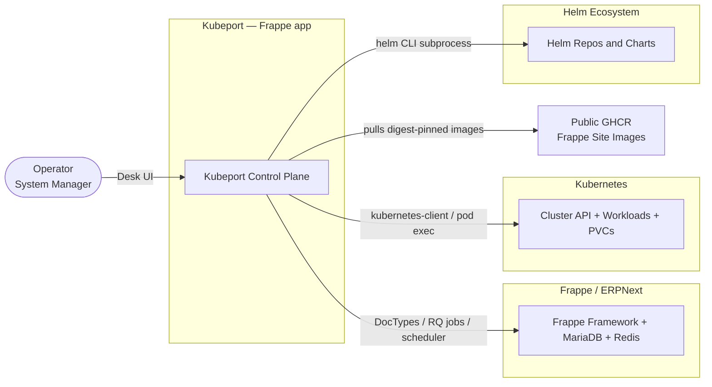
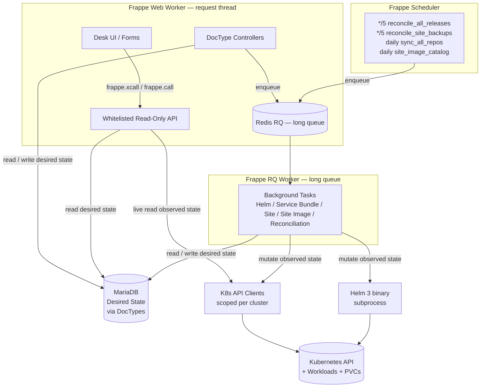
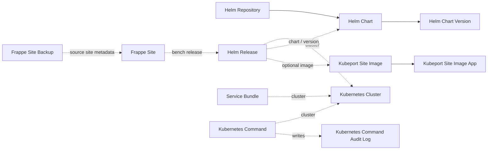
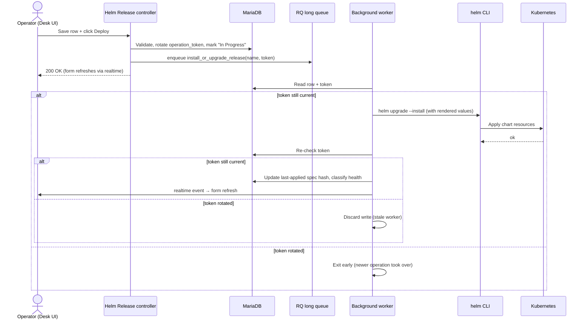
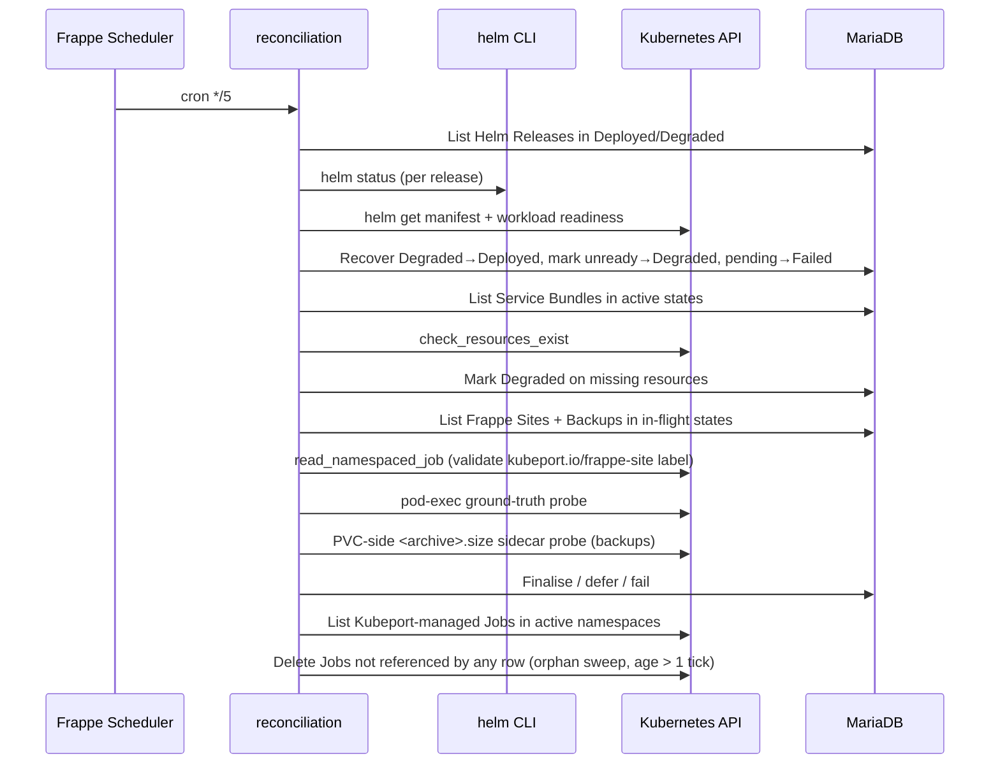
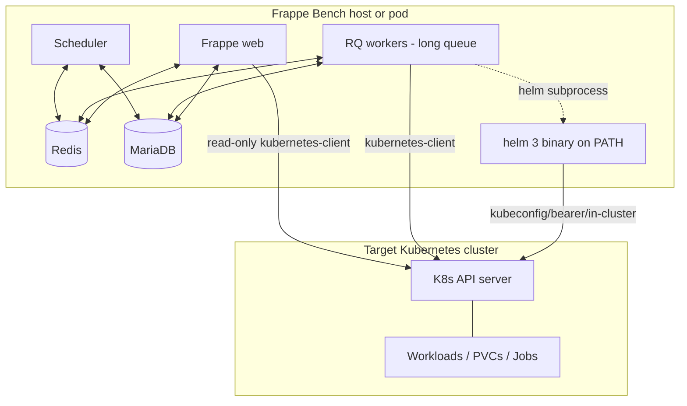

# Kubeport — Architecture

This document describes the Kubeport architecture using the [C4 model](https://c4model.com): system context, containers, key components, and the runtime sequences that exercise them. It is the technical reference behind the claims in [`docs/thesis.md`](thesis.md) and the capability inventory in [`docs/control-plane-state.md`](control-plane-state.md).

For the per-module reference, see [`docs/codebase-summary.md`](codebase-summary.md). For the authoritative invariants, see [`AGENTS.md`](../AGENTS.md).

---

## 1. Context (C4 Level 1)



**Actors and externals**

| Element | Role |
|---|---|
| Operator | A human in the System Manager role using the Frappe Desk UI. |
| Frappe Framework | Hosts Kubeport as a Frappe app; provides DocTypes (MariaDB), background queues (Redis / RQ), realtime events, and the scheduler. |
| Kubernetes | The target system. Kubeport reads observed state and writes desired state into clusters the operator has registered. |
| Helm | Out-of-process Helm 3 binary, invoked via `subprocess.run` with isolated kubeconfigs. |
| Public GHCR | Source of digest-pinned Frappe / ERPNext runtime images consumed by `Helm Release`. |

---

## 2. Containers (C4 Level 2)

Inside the Kubeport app the runtime decomposes into the following containers:



**Container responsibilities**

| Container | Path | Responsibility |
|---|---|---|
| Desk UI | DocType `*.js` | Async-first form behaviour; renders observed state via `frappe.xcall`. |
| Read-only API | `kubeport/api/` | Whitelisted endpoints. Type-annotated. Serves forms and discovery payloads. **Never mutates the cluster.** |
| DocType controllers | `kubeport/kubeport/doctype/*/...py` | Validate desired-state writes, enqueue work onto the `long` queue. |
| Background tasks | `kubeport/tasks/` | The only place cluster-mutating operations run. Per-run operation tokens. |
| Scheduler | `hooks.py` (`scheduler_events`) | 5-minute drift detection and orphan sweep; daily catalogue refreshes. |
| K8s API clients | `kubeport/utils/k8s_client.py` | Per-cluster scoped clients — no shared global state between requests. |
| Helm CLI wrapper | `kubeport/utils/helm.py` | Stateless subprocess wrapper with per-call temp kubeconfig. |
| MariaDB | Frappe-managed | Holds **desired** state only. |
| Kubernetes | External | Holds **observed** state. Queried live, never cached. |

---

## 3. Key Design Invariants

The architectural style is captured by eight numbered properties — four **safety** properties (nothing bad happens), three **liveness** properties (something good eventually happens), and one **eventual-consistency** property (state converges to truth). Each property terminates in a `Witness:` clause naming the file and line at which the property is enforced. The faults each property defends against are catalogued in [`docs/fault-model.md`](fault-model.md).

The properties below are intentionally narrower than the prose invariants in [`AGENTS.md`](../AGENTS.md): they are statements that can be checked by reading the witnesses and the surrounding code, not coding-style guidelines.

### 3.1 Safety properties

#### P1 (Safety) — Observed state is never written to MariaDB

The whitelisted discovery API and the per-form readers return live cluster data as ephemeral payloads. The only writes a reconciliation pass performs are to **status fields** of an existing desired-state row (`status`, `helm_status_detail`, `operation_*`), never the observed shape itself (pods, manifests, release inventories).

- Witness (read path): `kubeport/api/discovery.py:20` — `get_cluster_discovery` is `@frappe.whitelist()`-decorated and returns `dict[str, Any]` without persistence. Adoption of a discovered release is an explicit, separately whitelisted action (`kubeport/api/discovery.py:95`).
- Witness (write path): `kubeport/tasks/reconciliation.py:1820` — `_set_helm_reconciliation_state` performs targeted `frappe.db.set_value` writes scoped to status fields and gated on a stale-token check.

#### P2 (Safety) — No cluster-mutating call originates on the web thread

Every controller that triggers Helm, Service Bundle, or Frappe Site work hands off via `frappe.enqueue(..., queue="long", enqueue_after_commit=True)`. The Helm CLI subprocess wrapper and the `kubernetes` mutating client are reachable only from the `kubeport/tasks/` modules invoked by that queue or by the scheduler.

- Witness (controller hand-off): `kubeport/kubeport/doctype/helm_release/helm_release.py:149` — `deploy_release` rotates the token then enqueues `install_or_upgrade_release` on the `long` queue, with the same shape repeated for `uninstall_release` (`:194`) and `rollback_release` (`:231`).
- Witness (Service Bundle hand-off): `kubeport/kubeport/doctype/service_bundle/service_bundle.py:79`.
- Witness (Frappe Site hand-off): `kubeport/kubeport/doctype/frappe_site/frappe_site.py:149` — every site lifecycle operation goes through the same enqueue shape.
- Witness (subprocess boundary): `kubeport/utils/helm.py:512` — `_run_helm` is the single subprocess entry point and is called only from `kubeport/tasks/` and `kubeport/utils/helm.py` helpers, never from `kubeport/api/`.

#### P3 (Safety) — A stale worker never overwrites a newer operation's state

Every controller mutation rotates a 128-bit `operation_token` before enqueuing the worker, and every worker / reconciler write is gated on a re-read of the current token. Token mismatch turns the write into a no-op, regardless of whether it was the worker that lagged or a newer operator click that intervened.

- Witness (rotate): `kubeport/kubeport/doctype/helm_release/helm_release.py:141` — `secrets.token_hex(16)` rotated and persisted via targeted `db_set` immediately before each enqueue.
- Witness (worker re-check): `kubeport/tasks/site_tasks.py:1357` — `_site_operation_matches` reads the live token and status before any state write; `_backup_operation_matches` mirrors it for backup workers (`:1383`).
- Witness (reconciler re-check): `kubeport/tasks/reconciliation.py:1820` — `_set_helm_reconciliation_state` early-returns on token mismatch and logs the skip.
- Witness (no `doc.reload()`): the entire `kubeport/tasks/` tree contains zero `doc.reload()` calls (verifiable by `rg "doc\.reload\(\)" kubeport/tasks`).

#### P4 (Safety) — All Kubernetes API access is scoped to the target cluster

The single constructor `get_k8s_api_client(cluster_name)` is the only path that materialises a `kubernetes.client.ApiClient`. No module caches a client across requests; no global `kubernetes.config.load_*` call is reachable.

- Witness (factory): `kubeport/utils/k8s_client.py:24` — `get_k8s_api_client` builds a fresh client from the named `Kubernetes Cluster` row on every call.
- Witness (callers are scoped): `kubeport/tasks/site_tasks.py:191`, `:603`, `:703`; `kubeport/tasks/service_bundle_tasks.py:32`, `:78`; `kubeport/tasks/reconciliation.py:337`, `:441`, `:510`, `:1561`. Each call site receives a `cluster_name` argument from the desired-state row it is acting on.

### 3.2 Liveness properties

#### P5 (Liveness) — In-flight Helm operations cannot stay in-flight forever

If a worker dies between `helm upgrade --install` and the post-write that records terminal state, the row is stuck in `In Progress` or `Uninstalling` from the form's point of view. The 5-minute reconciler picks up any such row whose `operation_started_at` is older than `STALE_OPERATION_THRESHOLD_MINUTES` (30 minutes), re-runs the live Helm health classifier, and forces a terminal write. Recovery upper bound: `STALE_OPERATION_THRESHOLD_MINUTES + tick_interval` ≤ 35 minutes.

- Witness (threshold): `kubeport/utils/constants.py:17` — `STALE_OPERATION_THRESHOLD_MINUTES = 30`.
- Witness (predicate): `kubeport/tasks/reconciliation.py:1862` — `_helm_operation_is_stale`.
- Witness (recovery loop): `kubeport/tasks/reconciliation.py:155` — `_reconcile_stale_helm_operations` is wired into the 5-minute tick at `kubeport/tasks/reconciliation.py:64`.
- Witness (schedule): `kubeport/hooks.py:148` — `*/5 * * * *` cron entry.

#### P6 (Liveness) — Worker hard-kill before `db_set` does not leak Jobs

If the worker applies a `Frappe Site` operation Job to the cluster but is hard-killed before persisting `operation_job_name`, no DocType row references the Job. The orphan-sweep stage of every reconciliation tick lists Jobs labelled `app.kubernetes.io/managed-by=kubeport` in every `(cluster, namespace)` pair that has at least one site or backup row, and deletes those not referenced by any row's `operation_job_name`. A grace window protects against racing the apply→`db_set` window of a healthy worker. Recovery upper bound: `_ORPHAN_SWEEP_GRACE_SECONDS + 2 × tick_interval` ≤ 15 minutes.

- Witness (sweep): `kubeport/tasks/reconciliation.py:1499` — `_sweep_orphan_site_jobs`.
- Witness (grace): `kubeport/tasks/reconciliation.py:55` — `_ORPHAN_SWEEP_GRACE_SECONDS = 300`.
- Witness (Job carries the label so the sweep can identify it): `kubeport/tasks/site_tasks.py:53` (`SITE_DOC_LABEL`) and the manifest builder at `kubeport/tasks/site_tasks.py:861` (`activeDeadlineSeconds`).

#### P7 (Liveness) — Stuck pods cannot wedge a row in-flight

Every operation Job carries `activeDeadlineSeconds = _JOB_ACTIVE_DEADLINE_SECONDS` (1800 s = 30 min). A pod stuck in `ImagePullBackOff` or unable to reach the database eventually flips the Job to `failed`, at which point the next reconciliation tick reads the terminal status and writes the row's terminal state via the ground-truth probe.

- Witness (constant): `kubeport/tasks/site_tasks.py:49` — `_JOB_ACTIVE_DEADLINE_SECONDS = 1800`.
- Witness (applied to manifest): `kubeport/tasks/site_tasks.py:861` — `_build_op_job_manifest` sets the field on every site/backup/restore Job.

### 3.3 Eventual-consistency property

#### P8 (Eventual Consistency) — Status converges to ground truth, deferring rather than guessing

Where an exit code or a Helm status string is not trustworthy on its own, Kubeport probes the actual side effect, and the probe is **three-state** (`exists` / `missing` / `unknown`). Transient probe failures return `unknown`, which **defers** the status transition to the next tick rather than committing a possibly-wrong terminal state. Eventual convergence is guaranteed by the 5-minute reconciliation cadence; the liveness bound is the time until the underlying cluster transient clears.

- Witness (three-state constants): `kubeport/tasks/reconciliation.py:31` — `SITE_PROBE_EXISTS`, `SITE_PROBE_MISSING`, `SITE_PROBE_UNKNOWN`.
- Witness (site probe): `kubeport/tasks/reconciliation.py:1151` — `_probe_site_state` returns `unknown` on exec failure so the caller defers (`:568`, `:752`, `:786`, `:865`).
- Witness (backup PVC probe): `kubeport/tasks/reconciliation.py:1245` — `_probe_backup_archive_on_pvc` returns `("unknown", None)` on submission/read failure; the bench backup script writes the `<archive>.size` sidecar only on a fully flushed success.
- Witness (Job-identity defence): `kubeport/tasks/reconciliation.py:1414` — `_job_belongs_to_site` rejects writes when the `kubeport.io/frappe-site` label does not match the expected docname, so a hash collision or stale `operation_job_name` cannot finalise the wrong row.
- Witness (`Active` rows protected): `kubeport/kubeport/doctype/frappe_site/frappe_site.py:445` — `on_trash` refuses direct deletion of an `Active` row, and `_cancel_inflight_backups_for_site` (`:495`) keeps any linked in-flight backup row consistent with the parent's cancellation.

---

## 4. DocType Map (Components)

The desired-state model is expressed as twelve DocTypes plus an audit-log child.



| DocType | Purpose |
|---|---|
| `Kubernetes Cluster` | Cluster credentials and connectivity. Multi-auth (kubeconfig, bearer token, in-cluster). |
| `Helm Repository` | Repo configuration and per-run sync tokens. Daily background catalogue refresh. |
| `Helm Chart` | Repository-backed chart metadata; named `{repo}/{chart}`. |
| `Helm Chart Version` | Child table of `Helm Chart`. |
| `Helm Release` | Desired Helm release scoped to `cluster/namespace/release_name`. Optional `Kubeport Site Image` link. |
| `Service Bundle` | Desired raw-manifest set. Allowlist of 17 built-in resource kinds. |
| `Frappe Site` | Desired Frappe site on a `Helm Release` bench. Lifecycle: create / migrate / backup / restore / drop. |
| `Frappe Site Backup` | Standalone metadata for a backup archive on a namespace-local `kubeport-backups` PVC. |
| `Kubeport Site Image` | Public GHCR runtime image catalogue. Curated rows synced from `kubeport/site_images/catalog.json`; user rows manageable in the UI. |
| `Kubeport Site Image App` | Child of `Kubeport Site Image` — one row per Frappe / ERPNext / custom app baked in. |
| `Kubernetes Command` | Operator-tools doctype: ad-hoc Get / List / Delete with a fixed kind allowlist. |
| `Kubernetes Command Audit Log` | Append-only execution log; survives row deletion. |

Identity scoping for `Helm Release` matches real Helm scope (`cluster/namespace/release_name`), so Kubeport rows and the cluster's view of "which release is which" never disagree.

---

## 5. Runtime Sequences

### 5.1 Deploying a Helm Release



Health classification combines `helm status` with a workload-readiness walk over `helm get manifest` (Deployment / StatefulSet / DaemonSet / Pod / Job / PVC / Service / Ingress) — the same classifier is reused by the reconciliation loop in §5.3.

### 5.2 Creating a Frappe Site

```mermaid
sequenceDiagram
    actor Op
    participant C as Frappe Site controller
    participant W as site_tasks worker
    participant K as Kubernetes
    participant B as Bench pod
    participant R as Reconciler (every 5m)

    Op->>C: Save row (links to Helm Release bench) + Create Site
    C->>W: enqueue create_site_task

    W->>K: List pods on bench Helm Release
    K-->>W: Reference workload pod (image, sites PVC mount, env)
    W->>K: Create per-Job Secret (admin / DB-root creds)
    W->>K: Submit Job (bench new-site, owner-ref Secret)
    W->>C: Persist operation_job_name + operation_job_token

    K->>B: bench new-site --install-app=erpnext ...
    B-->>K: exit code (not trusted)
    Note over K,B: TTL on Job; ownerRef GC sweeps Secret

    R->>K: Read Job status by operation_job_name + label
    R->>B: pod-exec probe → look for site_config.json
    alt site exists
        R->>C: Mark Active
    else site missing
        R->>C: Mark Failed (with operation-specific log detail)
    else probe unknown
        R->>R: Defer to next tick
    end
```

The per-Job Secret is owner-referenced to the Job so it is garbage-collected by the Kubernetes Job's TTL cleanup. The reconciler is the **only** writer of the final `Active` / `Failed` state — the worker that submits the Job does not mark success on its own.

### 5.3 Reconciliation tick (every 5 minutes)



Stale `In Progress` / `Uninstalling` Helm operations are recovered after 30 minutes by re-checking live Helm status. `activeDeadlineSeconds` on every operation Job (default 30 min) ensures hung pods eventually flip to `failed` instead of leaving the row in-flight forever.

---

## 6. Layer Map (File-Level View)

For the per-file walk-through see [`docs/codebase-summary.md`](codebase-summary.md). The layer summary is:

| Layer | Path | Mutates cluster? | Reads cluster? | Persists desired state? |
|---|---|---|---|---|
| DocTypes | `kubeport/kubeport/doctype/` | No | No | Yes |
| Read-only API | `kubeport/api/` | No | Yes (live) | No |
| Utilities | `kubeport/utils/` | No (helpers only) | Yes | No |
| Background tasks | `kubeport/tasks/` | **Yes** | Yes | Yes (status fields) |
| Scheduled jobs | `hooks.py` | **Yes** (via tasks) | Yes | Yes (status fields) |

If a future change blurs any cell of this table, it is a violation of the design invariants in §3.

---

## 7. Operational Topology (Deployment View)



In the in-cluster auth mode, the Frappe Bench itself runs **inside** the target cluster, in which case no kubeconfig file is materialised; Helm and the kubernetes-client both read pod-mounted credentials.

---

## 8. References

- [`docs/thesis.md`](thesis.md) — project framing and results.
- [`docs/operator-guide.md`](operator-guide.md) — How to use the system end-to-end.
- [`docs/control-plane-state.md`](control-plane-state.md) — Capabilities, robustness defences, open gaps.
- [`docs/codebase-summary.md`](codebase-summary.md) — Per-module reference.
- [`docs/fault-model.md`](fault-model.md) — Tolerated faults, defences, and recovery upper bounds (companion to §3).
- [`AGENTS.md`](../AGENTS.md) — Authoritative invariants and implementation patterns.
- [`CHANGELOG.md`](../CHANGELOG.md) — Architecture decision log.
