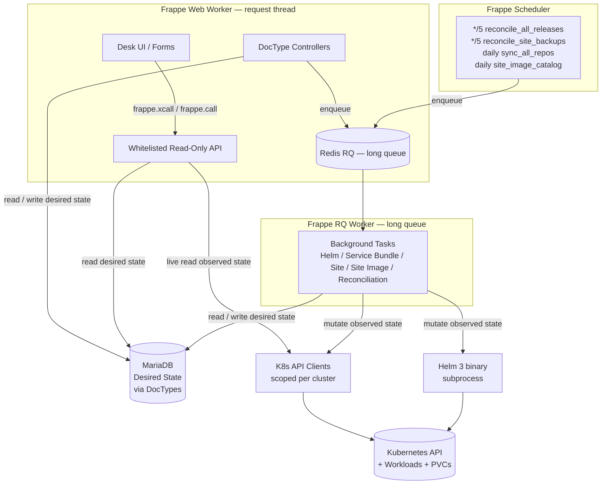
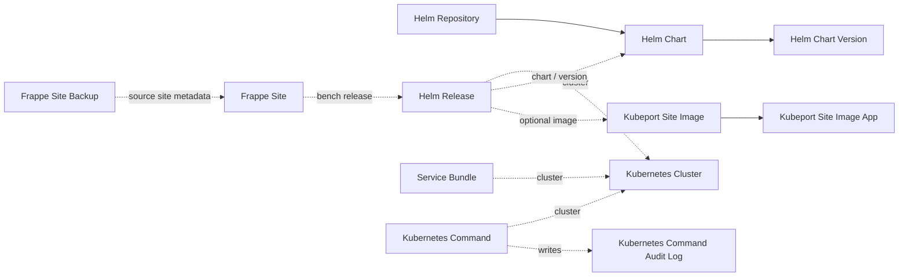
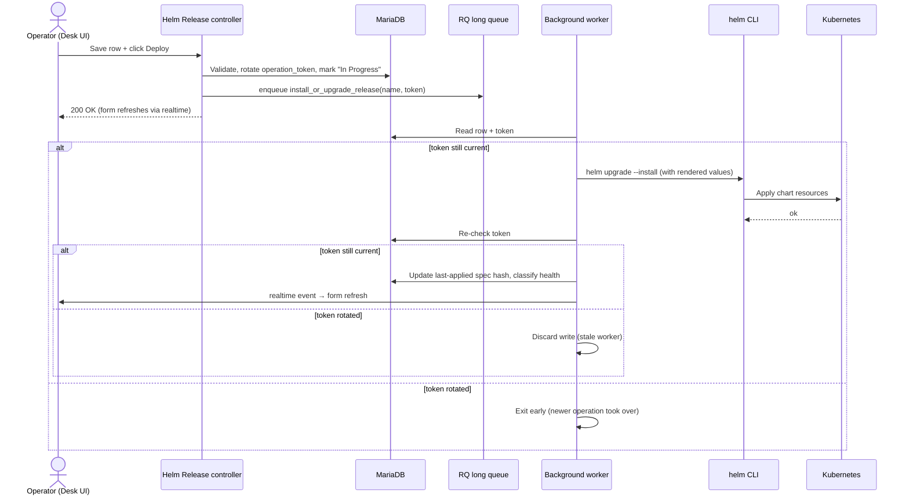
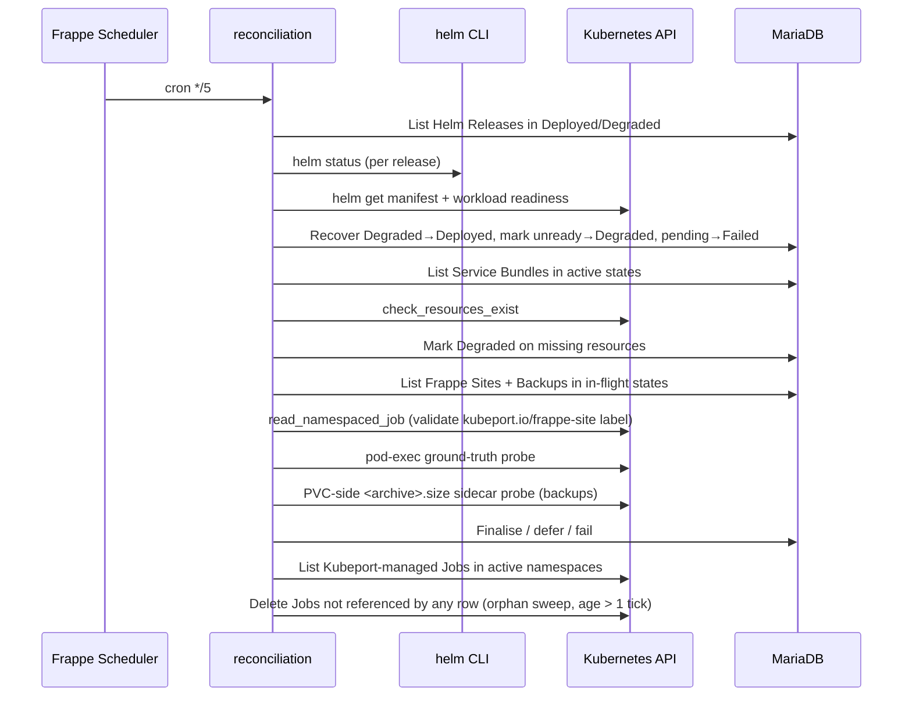
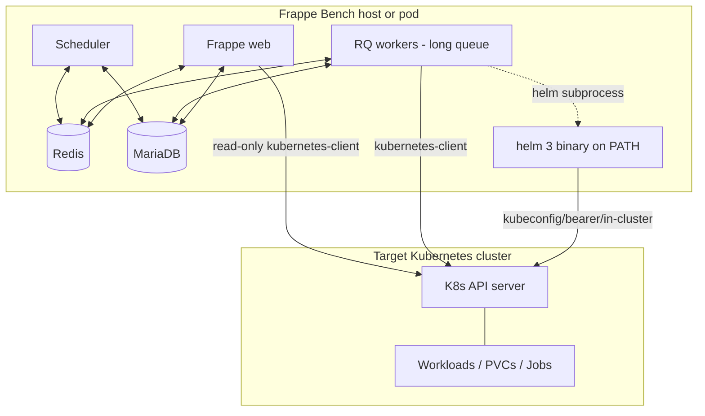

# Kubeport — Architecture

This document describes the Kubeport architecture using the [C4 model](https://c4model.com): system context, containers, key components, and the runtime sequences that exercise them. It is the technical reference behind the claims in [`docs/thesis.md`](thesis.md) and the capability inventory in [`docs/control-plane-state.md`](control-plane-state.md).

For the per-module reference, see [`docs/codebase-summary.md`](codebase-summary.md). For the authoritative invariants, see [`AGENTS.md`](../AGENTS.md).

---

## 1. Context (C4 Level 1)


**Actors and externals**

| Element | Role |
|---|---|
| Operator | A human in the System Manager role using the Frappe Desk UI. |
| Frappe Framework | Hosts Kubeport as a Frappe app; provides DocTypes (MariaDB), background queues (Redis / RQ), realtime events, and the scheduler. |
| Kubernetes | The target system. Kubeport reads observed state and writes desired state into clusters the operator has registered. |
| Helm | Out-of-process Helm 3 binary, invoked via `subprocess.run` with isolated kubeconfigs. |
| Public GHCR | Source of digest-pinned Frappe / ERPNext runtime images consumed by `Helm Release`. |

---

## 2. Containers (C4 Level 2)

Inside the Kubeport app the runtime decomposes into the following containers:



**Container responsibilities**

| Container | Path | Responsibility |
|---|---|---|
| Desk UI | DocType `*.js` | Async-first form behaviour; renders observed state via `frappe.xcall`. |
| Read-only API | `kubeport/api/` | Whitelisted endpoints. Type-annotated. Serves forms and discovery payloads. **Never mutates the cluster.** |
| DocType controllers | `kubeport/kubeport/doctype/*/...py` | Validate desired-state writes, enqueue work onto the `long` queue. |
| Background tasks | `kubeport/tasks/` | The only place cluster-mutating operations run. Per-run operation tokens. |
| Scheduler | `hooks.py` (`scheduler_events`) | 5-minute drift detection and orphan sweep; daily catalogue refreshes. |
| K8s API clients | `kubeport/utils/k8s_client.py` | Per-cluster scoped clients — no shared global state between requests. |
| Helm CLI wrapper | `kubeport/utils/helm.py` | Stateless subprocess wrapper with per-call temp kubeconfig. |
| MariaDB | Frappe-managed | Holds **desired** state only. |
| Kubernetes | External | Holds **observed** state. Queried live, never cached. |

---

## 3. Key Design Invariants

These four invariants together define the architectural style of the project. They are restated and elaborated in [`AGENTS.md`](../AGENTS.md).

### 3.1 Desired state vs. observed state are never mixed

| Where it lives | What it describes | Authority |
|---|---|---|
| MariaDB (DocTypes) | What the operator **wants** to be true: registered clusters, declared releases, declared sites, declared bundles. | Kubeport row is the source of truth. |
| Cluster (live) | What is **currently** true: pod phases, Helm release status, site existence on a bench PVC. | The cluster is the source of truth. Discovery is read-only. |

Discovery payloads are **never** persisted into MariaDB. The reconciliation loop reads observed state, compares it against desired state, and writes only **status fields** back to MariaDB — never the observed shape itself.

### 3.2 All cluster mutations run out of the request thread

Web request handlers must finish quickly and return useful responses to the form. Helm operations, K8s Job submissions, manifest applies, and chart syncs all run inside `frappe.enqueue(..., queue="long", enqueue_after_commit=True)`. The web thread never blocks on Helm or `kubectl`-equivalent calls.

### 3.3 Concurrency safety via per-run tokens

Every long-running operation rotates a per-run token (`operation_token` for `Helm Release`, `Service Bundle`, `Frappe Site`; `sync_token` for `Helm Repository`; `operation_job_token` for the K8s Job snapshot of `Frappe Site`). Workers re-read the document and check the token **before** writing any state. A stale worker can never overwrite a newer operation's state.

State updates are targeted (`db_set` / `frappe.db.set_value`) — never `doc.reload()` in a worker — to avoid racing concurrent updates from the form.

### 3.4 Ground-truth verification of side effects

Where an exit code or a Helm status string is not trustworthy on its own, Kubeport probes the actual side effect:

- **Site creation / deletion / migration**: pod-exec into the bench, look for `site_config.json` and `bench list-apps` output. Three-state probe (`exists`, `missing`, `unknown`) — `unknown` defers the status transition rather than marking the row failed.
- **Backup completion**: a short-lived `busybox` probe pod mounts the backup PVC and reads the `<archive>.size` sidecar that the bench backup script writes only on a fully-flushed success.
- **Helm release health**: the deploy worker and the reconciler share a single classifier built on `helm get manifest` plus per-resource readiness for built-in kinds.
- **Job identity**: every operation Job carries a `kubeport.io/frappe-site` label; reconciliation validates the label before trusting the Job's status.

---

## 4. DocType Map (Components)

The desired-state model is expressed as twelve DocTypes plus an audit-log child.



| DocType | Purpose |
|---|---|
| `Kubernetes Cluster` | Cluster credentials and connectivity. Multi-auth (kubeconfig, bearer token, in-cluster). |
| `Helm Repository` | Repo configuration and per-run sync tokens. Daily background catalogue refresh. |
| `Helm Chart` | Repository-backed chart metadata; named `{repo}/{chart}`. |
| `Helm Chart Version` | Child table of `Helm Chart`. |
| `Helm Release` | Desired Helm release scoped to `cluster/namespace/release_name`. Optional `Kubeport Site Image` link. |
| `Service Bundle` | Desired raw-manifest set. Allowlist of 17 built-in resource kinds. |
| `Frappe Site` | Desired Frappe site on a `Helm Release` bench. Lifecycle: create / migrate / backup / restore / drop. |
| `Frappe Site Backup` | Standalone metadata for a backup archive on a namespace-local `kubeport-backups` PVC. |
| `Kubeport Site Image` | Public GHCR runtime image catalogue. Curated rows synced from `kubeport/site_images/catalog.json`; user rows manageable in the UI. |
| `Kubeport Site Image App` | Child of `Kubeport Site Image` — one row per Frappe / ERPNext / custom app baked in. |
| `Kubernetes Command` | Operator-tools doctype: ad-hoc Get / List / Delete with a fixed kind allowlist. |
| `Kubernetes Command Audit Log` | Append-only execution log; survives row deletion. |

Identity scoping for `Helm Release` matches real Helm scope (`cluster/namespace/release_name`), so Kubeport rows and the cluster's view of "which release is which" never disagree.

---

## 5. Runtime Sequences

### 5.1 Deploying a Helm Release



Health classification combines `helm status` with a workload-readiness walk over `helm get manifest` (Deployment / StatefulSet / DaemonSet / Pod / Job / PVC / Service / Ingress) — the same classifier is reused by the reconciliation loop in §5.3.

### 5.2 Creating a Frappe Site

```mermaid
sequenceDiagram
    actor Op
    participant C as Frappe Site controller
    participant W as site_tasks worker
    participant K as Kubernetes
    participant B as Bench pod
    participant R as Reconciler (every 5m)

    Op->>C: Save row (links to Helm Release bench) + Create Site
    C->>W: enqueue create_site_task

    W->>K: List pods on bench Helm Release
    K-->>W: Reference workload pod (image, sites PVC mount, env)
    W->>K: Create per-Job Secret (admin / DB-root creds)
    W->>K: Submit Job (bench new-site, owner-ref Secret)
    W->>C: Persist operation_job_name + operation_job_token

    K->>B: bench new-site --install-app=erpnext ...
    B-->>K: exit code (not trusted)
    Note over K,B: TTL on Job; ownerRef GC sweeps Secret

    R->>K: Read Job status by operation_job_name + label
    R->>B: pod-exec probe → look for site_config.json
    alt site exists
        R->>C: Mark Active
    else site missing
        R->>C: Mark Failed (with operation-specific log detail)
    else probe unknown
        R->>R: Defer to next tick
    end
```

The per-Job Secret is owner-referenced to the Job so it is garbage-collected by the Kubernetes Job's TTL cleanup. The reconciler is the **only** writer of the final `Active` / `Failed` state — the worker that submits the Job does not mark success on its own.

### 5.3 Reconciliation tick (every 5 minutes)



Stale `In Progress` / `Uninstalling` Helm operations are recovered after 30 minutes by re-checking live Helm status. `activeDeadlineSeconds` on every operation Job (default 30 min) ensures hung pods eventually flip to `failed` instead of leaving the row in-flight forever.

---

## 6. Layer Map (File-Level View)

For the per-file walk-through see [`docs/codebase-summary.md`](codebase-summary.md). The layer summary is:

| Layer | Path | Mutates cluster? | Reads cluster? | Persists desired state? |
|---|---|---|---|---|
| DocTypes | `kubeport/kubeport/doctype/` | No | No | Yes |
| Read-only API | `kubeport/api/` | No | Yes (live) | No |
| Utilities | `kubeport/utils/` | No (helpers only) | Yes | No |
| Background tasks | `kubeport/tasks/` | **Yes** | Yes | Yes (status fields) |
| Scheduled jobs | `hooks.py` | **Yes** (via tasks) | Yes | Yes (status fields) |

If a future change blurs any cell of this table, it is a violation of the design invariants in §3.

---

## 7. Operational Topology (Deployment View)



In the in-cluster auth mode, the Frappe Bench itself runs **inside** the target cluster, in which case no kubeconfig file is materialised; Helm and the kubernetes-client both read pod-mounted credentials.

---

## 8. References

- [`docs/thesis.md`](thesis.md) — project framing and results.
- [`docs/operator-guide.md`](operator-guide.md) — How to use the system end-to-end.
- [`docs/control-plane-state.md`](control-plane-state.md) — Capabilities, robustness defences, open gaps.
- [`docs/codebase-summary.md`](codebase-summary.md) — Per-module reference.
- [`AGENTS.md`](../AGENTS.md) — Authoritative invariants and implementation patterns.
- [`CHANGELOG.md`](../CHANGELOG.md) — Architecture decision log.
